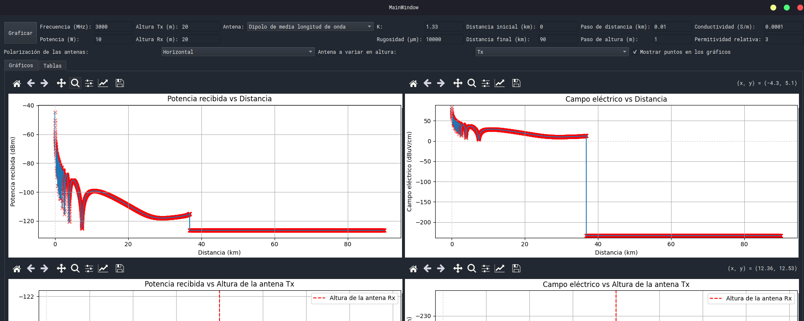

# VHF & UHF Propagation Tool

- [VHF \& UHF Propagation Tool](#vhf--uhf-propagation-tool)
  - [Contexto](#contexto)
  - [Consigna](#consigna)
  - [TO-DO](#to-do)
    - [Core](#core)
    - [Aesthetic](#aesthetic)
    - [Old](#old)
  - [Requisitos](#requisitos)
  - [Ejecución](#ejecución)
  - [Crear Instalador](#crear-instalador)
    - [Windows](#windows)
    - [Linux](#linux)

## Contexto 

ITBA, Ingeniería Electrónica

Curso: 22.21 - Electromagnetismo, 2Q 2024

Trabajo practico adicional

Grupo 1:
* AGRIPPINO, Franco
* DOLHARE, Mariano
* HEIR, Alejandro Nahuel

## Consigna
*Radiopropagación en las bandas de VHF (30-300 MHz) y UHF (300-3.000 MHz)*

El objetivo de este trabajo es realizar un estudio de la propagación por onda espacial (directa y reflejada) sobre tierra esférica con rugosidad en la superficie y refracción troposférica en zona de visibilidad (línea de vista) ~~y difracción (transhorizonte)~~.

Como entregable, se debe desarrollar un programa de cálculo de enlace (GUI). El programa debe permitir el cálculo de la potencia recibida y el campo eléctrico para radioenlace tanto en un esquema punto a punto como también poder variar la distancia entre Tx y Rx o las alturas de las antenas.

Entradas básicas para el programa: estas entradas son las variables que el usuario debe poder modificar acorde al enlace que desea calcular.
1. Frecuencia
2. Potencia
3. Altura de antenas Tx y Rx
4. Tipo de antena (dipolo de media longitud de onda, monopolo de cuarto de longitud de onda. isotrópica)
5. Polarización de las antenas
6. Factor efectivo del radio terrestre.
7. Rugosidad del terreno.
8. Distancia, inicial y final, paso de avance en distancia
9. Conductividad y permitividad del terreno
Salidas: estos son los resultados que el programa debe poder calcular.
1. Potencia recibida.
   1. Punto a Punto.
   2. Variación con la distancia. (gráfico y tabla)
   3. Variación con la altura de una de las antenas. (gráfico y tabla)
2. Campo eléctrico para el radioenlace.
   1. Punto a Punto.
   2. Variación con la distancia. (gráfico y tabla)
   3. Variación con la altura de una de las antenas. (gráfico y tabla)

## TO-DO

### Core


1. ~~Polarización de antenas: solo vertical+vertical o horizontal+horizontal~~
   1. ~~Remover ángulo~~
   2. ~~Afecta en quedarte con los coefs // o perpendicular.~~
2. ~~Verificar cálculo de tierra esférica:~~
   ~~1. Alturas ht y hr efectivas, que daban negativas y rompían el factor de divergencia~~
3. ~~Revisar efecto de tipo de antena; no parecía afectar.~~
4. Revisar que cambiar "cosas" hace cambiar valores
   1. Revisar valor inicial de rugosidad (se cambió a $\mu$m)
   2. (creemos solucionado) ~~Rampita?? ~~
      1. 
5. Buscar alguna simulación/medición hecha con valores conocidos para contrastar lo nuestro.
   1. ¿Buscar nosotros? ¿Patricio?
6. ~~Ajustar valores default (permitivadad > 1)~~
   1. OPCIONAL: poner presets como tierra húmeda
7. ~~Agregar cursores sobre los gráficos, para poder ver valor en cierto punto:~~
  * ~~Cursor a mano~~
8. ~~Revisar indices/distancias mínimas para arrancar a calcular.~~
9.  ~~**Se detecta Psi negativo**!=~~
   1.  ~~Y también en la pic 4.2.1~~
10. ~~Exportar bien tablas.~~
11. ~~Agregar a las tablas coefs de reflexión total~~
12. ~~Revisar ganancia de curva por espacio libre. ¿Hacerla toggeable? Agregarla al plot de espacio eléctrico.~~
13. Rampita. Esperar a data de Patricio. // Umbral límite de D.
14. ~~En los gráficos en función de la altura sería interesante que calcularán el número de zona de Fresnel despejada, lo charlamos después.~~

### Aesthetic

1. ~~Ajustar escalas verticales~~
   * ~~Potencias: dBm~~
   * ~~Campo eléctrico: dBμ (decibeles sobre microvoltio por metro)~~
2. ~~Plots de potencia arrancan siempre en +4dBm~~
3. ~~**Agregar línea vertical en el límite de transhorizonte**~~
4. ~~Autoajustar ancho de tablas al contenido~~

### Old

- ~~Omitir di fracción transhorizonte~~

- ~~Agregar cálculo con radio terrestre (k)~~

- ~~Sobre rugosidad: criterio Rayleigh~~
  * ~~Multiplica luego a los coeficientes de Fresnel~~
  
- ~~Sobre tipos de antena: solo modificar la ganancia.~~

## Requisitos

Asegúrate de tener instaladas las siguientes dependencias:
```
pip install -r requirements.txt
```

## Ejecución

Para ejecutar la aplicación, usa el siguiente comando:
```
python main.py
```


## Crear Instalador

### Windows

Para crear un instalador para Windows, sigue estos pasos:

1. **Instalar PyInstaller**:
   ```bash
   pip install pyinstaller
   ```

2. **Crear el ejecutable**:
   ```bash
   pyinstaller --onefile --windowed main.py
   ```
   Esto generará un ejecutable en la carpeta `dist`.

3. **Instalar Inno Setup**: descarga e instala Inno Setup desde [aquí](http://www.jrsoftware.org/isinfo.php).

4. **Crear un script de Inno Setup**: crea un archivo llamado `setup.iss` con el siguiente contenido:
    ```
    [Setup]
    AppName=PropagationCalculator
    AppVersion=1.0
    DefaultDirName={pf}\PropagationCalculator
    DefaultGroupName=PropagationCalculator
    OutputDir=.
    OutputBaseFilename=PropagationCalculatorSetup
    Compression=lzma
    SolidCompression=yes

    [Files]
    Source: "dist\main.exe"; DestDir: "{app}"; Flags: ignoreversion

    [Icons]
    Name: "{group}\PropagationCalculator"; Filename: "{app}\main.exe"
    Name: "{group}\Uninstall PropagationCalculator"; Filename: "{uninstallexe}"
    ```

5. **Compilar el script de Inno Setup**: abre Inno Setup y compila el script `setup.iss`. Esto generará un archivo de instalación `.exe`.

###  Linux
Para crear un instalador para Linux, sigue estos pasos:

1. **Instalar PyInstaller**:
   ```bash
   pip install pyinstaller
   ```

2. **Crear el ejecutable**:
   ```bash
   pyinstaller --onefile --windowed main.py
   ```
   Esto generará un ejecutable en la carpeta `dist`.

3. **Instalar makeself:** En la mayoría de las distribuciones de Linux, puedes instalar makeself desde los repositorios:
    ```bash
    sudo apt-get install makeself
    ```
    ```bash
    yay -S makeself
    ```

4. **Crear el instalador con makeself**:
    ```bash
    makeself --notemp dist PropagationCalculatorInstaller.sh "Propagation Calculator Installer" ./main
    ```
    Esto generará un archivo `PropagationCalculatorInstaller.sh` que puedes distribuir.